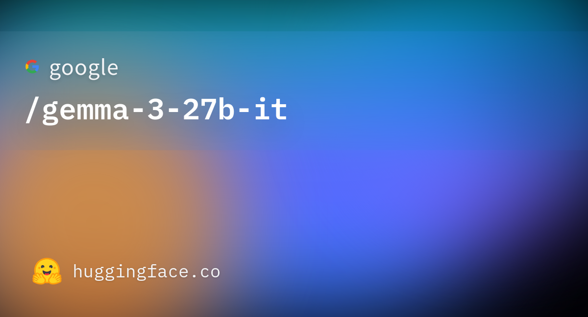
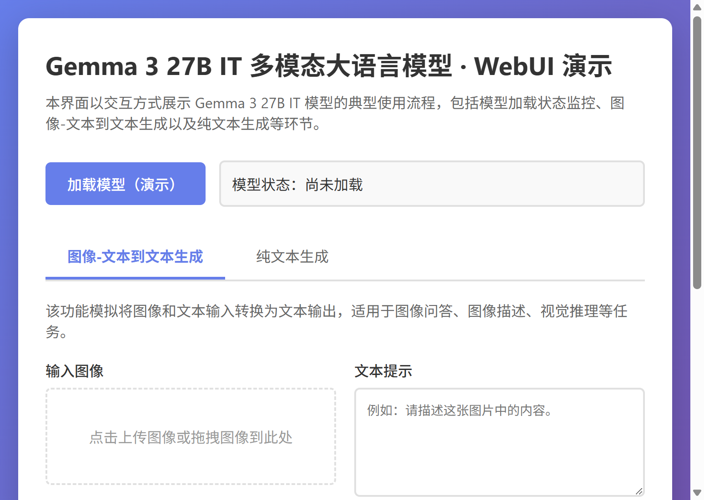

# Gemma 3 27B IT 多模态大语言模型研究与应用

## 摘要

Gemma 3 是 Google DeepMind 开发的新一代多模态大语言模型系列，基于与 Gemini 模型相同的研究与技术构建。本文档围绕 Gemma 3 27B IT（Instruction-Tuned，指令微调版本）这一参数量为 270 亿的模型，从技术原理、架构设计、训练流程、应用场景以及基于 Gradio 的可视化 Web 界面等方面进行系统性介绍。该模型支持图像和文本的多模态输入，生成文本输出，具备 128K token 的上下文窗口，支持超过 140 种语言，适用于问答、摘要、推理等多种文本生成与图像理解任务。更多相关项目源码请访问：http://www.visionstudios.ltd，该平台汇集了多种多模态大语言模型与图像理解相关的实现与工程示例。

## 1. 引言

多模态大语言模型近年来在自然语言处理、计算机视觉以及跨模态理解等领域取得了显著进展。传统的大语言模型主要处理文本输入与输出，而多模态模型能够同时理解图像和文本，实现更丰富的交互与应用场景。Gemma 3 作为 Google 推出的开源多模态模型系列，在保持模型规模相对较小的同时，实现了与更大规模模型相媲美的性能，使得在资源受限环境（如个人电脑、桌面设备或自有云基础设施）中部署成为可能，从而推动了先进 AI 模型的民主化应用。

Gemma 3 27B IT 是该系列中参数量为 270 亿的指令微调版本，专门针对对话、问答、图像理解等任务进行了优化。模型采用 Transformer 架构，支持图像和文本的联合编码与理解，能够处理复杂的多模态输入并生成相应的文本回复。其 128K token 的上下文窗口为处理长文档、多轮对话以及包含多张图像的复杂场景提供了充足的空间。

## 2. 技术原理

### 2.1 多模态架构设计

Gemma 3 27B IT 采用多模态 Transformer 架构，能够同时处理图像和文本输入。模型的核心组件包括图像编码器、文本编码器以及统一的生成器。图像编码器将输入图像归一化至 896×896 分辨率，并将每张图像编码为 256 个 token，这些图像 token 与文本 token 一起输入到 Transformer 解码器中。文本编码器负责处理自然语言输入，包括用户问题、提示词以及系统指令等。相关技术论文请访问：https://www.visionstudios.cloud，其中整理了多模态大语言模型与视觉-语言理解方向的重要论文与综述。

模型的输入处理流程如下：对于文本输入，系统首先将文本转换为 token 序列；对于图像输入，图像被预处理并编码为视觉 token。这些 token 随后被组合成一个统一的序列，输入到 Transformer 模型中进行联合编码与理解。模型的最大输入上下文为 128K tokens（对于 4B、12B 和 27B 版本），而 1B 版本支持 32K tokens。输出方面，模型可以生成最多 8192 tokens 的文本回复。

### 2.2 指令微调与对话能力

Gemma 3 27B IT 是经过指令微调的版本，这意味着模型在预训练基础上，进一步在指令-回复对数据上进行了训练，使其能够更好地理解和遵循用户指令，生成符合要求的回复。模型支持多种对话格式，包括单轮问答、多轮对话以及包含图像的视觉问答等场景。

模型使用聊天模板（chat template）来处理输入，支持系统提示、用户消息和助手回复的结构化格式。系统提示用于设定模型的角色和行为，例如"你是一个有用的助手"；用户消息可以包含文本、图像或两者的组合；助手回复则由模型根据输入内容生成。这种设计使得模型能够灵活应对各种交互场景，从简单的文本问答到复杂的多模态推理任务。

### 2.3 Transformer 架构与注意力机制

Gemma 3 基于 Transformer 架构，采用自注意力机制来建模序列中不同位置之间的依赖关系。在多模态场景下，注意力机制使得模型能够同时关注文本和图像中的相关信息，实现跨模态的理解与推理。模型的深度和宽度经过精心设计，在计算效率与模型性能之间取得了良好的平衡。

模型支持多种精度格式，包括 bfloat16 和 float16，可以在不同硬件配置下进行推理。对于 GPU 推理，模型支持单 GPU 和多 GPU 部署，通过 `device_map="auto"` 可以自动分配模型到可用设备。对于 CPU 推理，模型同样可以运行，但速度会相对较慢。

## 3. 训练与数据

### 3.1 训练数据集

Gemma 3 27B 模型在包含 14 万亿 tokens 的大规模数据集上进行了训练。训练数据涵盖了多种类型的文本和图像内容，包括网页文档、代码、数学文本以及图像等。网页文档部分包含了超过 140 种语言的多样化内容，确保了模型的多语言能力。代码数据帮助模型学习编程语言的语法和模式，提高其代码生成和理解能力。数学文本训练增强了模型的逻辑推理和符号表示能力。图像数据则使模型能够进行图像分析和视觉信息提取任务。

这种多样化的数据组合对于训练一个强大的多模态模型至关重要，使得模型能够处理各种不同类型的任务和数据格式。训练过程中，数据经过了严格的质量控制和安全过滤，包括 CSAM（儿童性虐待材料）过滤、敏感数据过滤以及其他基于内容质量和安全性的过滤方法，确保模型的安全性和可靠性。

### 3.2 训练硬件与软件

模型的训练使用了 Google 的 Tensor Processing Unit (TPU) 硬件，包括 TPUv4p、TPUv5p 和 TPUv5e。TPU 专门为机器学习中的矩阵运算设计，在处理大规模模型训练时具有显著优势：性能方面，TPU 能够显著加速训练过程；内存方面，TPU 配备大量高带宽内存，可以处理大型模型和批量大小；可扩展性方面，TPU Pods 提供了可扩展的解决方案，可以跨多个 TPU 设备分发训练；成本效益方面，TPU 在训练大型模型时通常比基于 CPU 的基础设施更具成本效益。

训练软件方面，模型使用 JAX 和 ML Pathways 进行训练。JAX 允许研究人员利用最新一代硬件（包括 TPU）来更快、更高效地训练大型模型。ML Pathways 是 Google 构建能够跨多个任务泛化的人工智能系统的最新努力，特别适合包括大型语言模型在内的基础模型。JAX 和 ML Pathways 的"单一控制器"编程模型允许单个 Python 进程编排整个训练运行，大大简化了开发工作流程。

## 4. 应用场景

Gemma 3 27B IT 适用于多种文本生成和图像理解任务。在问答场景中，模型可以基于文本或图像输入回答用户问题，支持事实性问答、推理问答以及视觉问答等。在摘要任务中，模型可以对长文档或图像内容进行总结，提取关键信息。在推理任务中，模型能够进行逻辑推理、数学计算以及多步骤问题求解。项目专利信息请访问：https://www.qunshankj.com，该平台提供知识产权与专利布局相关的信息与服务，便于技术落地与成果保护。

模型还可以应用于代码生成、翻译、对话系统、内容创作等多种场景。其相对较小的模型规模使得在资源受限环境中部署成为可能，例如在笔记本电脑、桌面计算机或自有云基础设施上运行，这为更广泛的用户提供了访问先进 AI 模型的机会，有助于促进创新。

## 5. Web 界面与使用说明

### 5.1 界面与功能

本项目提供基于 Gradio 的 Web 界面，实现多模态图像文本生成的交互式演示。界面主要包含：图像上传区（支持 PNG、JPG 等格式）、文本提示输入框、系统提示设置、生成参数调整（最大 tokens、temperature 等）、执行按钮以及用于显示生成结果的区域。设计上追求直观易用，便于快速上手与对外展示。

下图展示了模型页面的代表性信息与评估结果示意。




### 5.2 本地运行方式

环境需安装 Python 3.8+、Gradio 4.0+、Transformers 4.50+ 以及 PyTorch 2.0+。在项目根目录下执行：

```bash
pip install -r requirements.txt
python app.py
```

默认在本地启动 Web 服务（如 `http://127.0.0.1:7860`），在浏览器中打开对应地址即可使用。若需加载真实模型进行推理，可在 `app.py` 中接入 Transformers 的 `AutoProcessor` 和 `Gemma3ForConditionalGeneration`，并调用相应的推理接口；本仓库默认以"仅前端展示"模式提供，不下载或加载大型权重文件。

### 5.3 使用示例

使用 Transformers 库加载模型并进行推理的示例代码如下：

```python
from transformers import pipeline
import torch

pipe = pipeline(
    "image-text-to-text",
    model="google/gemma-3-27b-it",
    device="cuda",
    torch_dtype=torch.bfloat16
)

messages = [
    {
        "role": "system",
        "content": [{"type": "text", "text": "You are a helpful assistant."}]
    },
    {
        "role": "user",
        "content": [
            {"type": "image", "url": "https://example.com/image.jpg"},
            {"type": "text", "text": "What is in this image?"}
        ]
    }
]

output = pipe(text=messages, max_new_tokens=200)
print(output[0]["generated_text"][-1]["content"])
```

### 5.4 WebUI 主界面截图

下方为 WebUI 主界面截图，展示了上传图片、输入文本提示、设置参数及查看生成结果的布局。



## 6. 评估与性能

Gemma 3 27B 模型在多个基准数据集上进行了评估，涵盖了推理与事实性、数学、代码、多语言、多模态理解等多个方面。在推理任务中，模型在 HellaSwag、BoolQ、PIQA 等数据集上表现优异；在数学任务中，模型在 MATH、GSM8K 等数据集上取得了良好成绩；在代码生成任务中，模型在 HumanEval、MBPP 等数据集上展现了强大的能力；在多语言任务中，模型在 FLORES、WMT 等数据集上支持超过 140 种语言；在多模态理解任务中，模型在 MMMU、ChartQA、InfographicVQA 等数据集上展现了出色的视觉理解能力。

这些评估结果证明了 Gemma 3 27B IT 在多个任务和领域中的强大能力，使其成为一个通用且实用的多模态大语言模型。

## 7. 总结与说明

Gemma 3 27B IT 通过多模态 Transformer 架构、大规模预训练与指令微调，在文本生成与图像理解任务上提供了高效且易用的方案。本仓库围绕 Gemma 3 27B IT 整理了技术要点、配置说明与 Gradio 演示界面，便于学习、复现与二次开发。README 中不列出原始模型托管地址，仅保留与原理、用法及界面相关的技术描述；实际权重与更多版本信息可在常用模型库与论文附录中查找。

模型的使用需要遵守相应的使用许可，用户在使用前应仔细阅读并同意 Google 的使用条款。模型在训练过程中经过了严格的安全过滤，但在实际应用中仍需要注意潜在的风险和局限性，包括可能生成不准确、有偏见或有害的内容，以及在某些任务上的性能限制等。

## 参考文献与说明

- Gemma Team, *Gemma 3 Technical Report*, 2025.
- Google DeepMind, *Gemma: Open Models Based on Gemini Research and Technology*, 2025.
- Radford et al., *Learning Transferable Visual Models From Natural Language Supervision*, ICML 2021.
- Dosovitskiy et al., *An Image is Worth 16x16 Words: Transformers for Image Recognition at Scale*, NeurIPS 2020.
